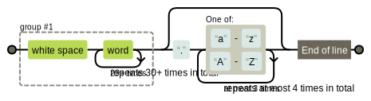

## Описание

**Case:**

- При экспорте из Notion в наименовании файлов и папок присутствуют идентификаторы.
- В файлах .md ссылки закодированы в url encoding и в них также присутствуют идентификаторы.

**Задачи:**

- Распаковка экспортированного архива.
- Удаление идентификаторов из наименований всех директорий и файлов.
- Декодирование всех ссылок в .md файлах и удаление идентификаторов.

### RegEx

Источник: https://regexper.com/

- Поиск идентификатора в наименовании файлов и директорий:
    
    ```python
    regex = re.compile(r"(\s\w{30,})(?:\.[a-zA-Z]{1,4})?$")
    ```
    
    
    
- Поиск ссылок в .md файле:
    
    ```python
    regex = re.compile(r"\[(?:\n)?.*\(?.*\)?.*\](\(.*\.[a-zA-Z]{1,4}\))")
    ```
    
    .svg)
    
- Обработка ссылок в .md файле (удаление идентификаторов):
    
    ```python
    u_regex = re.compile(r"(\s\w{30,})(?:\/|(?:\.[a-zA-Z]{1,4}))")
    u_match = u_regex.findall(unquote_el.replace("\\", "/"))
    ```
    
    .svg)